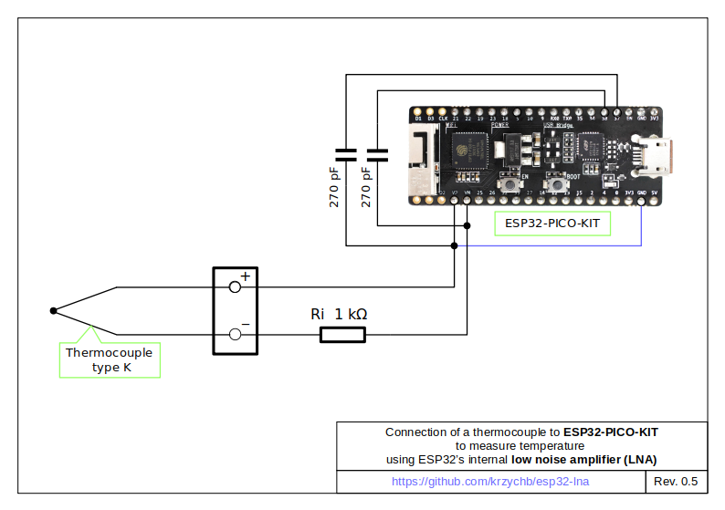

# ESP32 LNA

One of features of ESP32 that has been intriguing me since its release back in September 2016 was [low noise amplifier](https://github.com/espressif/esp-idf/issues/814) (LNA).

Together with other analog components like [Hall sensor](https://randomnerdtutorials.com/esp32-hall-effect-sensor/), [temperature sensor](https://www.esp32.com/viewtopic.php?t=5#p21), [capacitive touch sensor](https://github.com/espressif/esp-iot-solution/blob/master/documents/touch_pad_solution/touch_sensor_design_en.md), [cosine waveform generator](https://github.com/krzychb/dac-cosine), as well as ordinary ADC and DAC, they offer interesting functionality options right on a bare chip, without additional components.

### The Story

When I learned about the LNA for the first time I immediately recalled a workshop by [Cypress](https://www.cypress.com) where I got familiar with [programmable system-on-chip](https://en.wikipedia.org/wiki/Programmable_system-on-chip) (PSoC) microcontrollers that provide similar functionality, but on far larger scale. Is [Espressif](https://www.espressif.com) going to offer a marriage of digital and programmable analog functionality on a single chip? That would be awesome!

Some time later, in May 2017, the LNA has been officially documented in [ESP32 Technical Reference Manual](https://twitter.com/krzychb2/status/860466927310958593?lang=en). 

Then one year later, in June 2018, description of the LNA (and temperature sensor) has been removed from the [reference manual](https://www.espressif.com/sites/default/files/documentation/esp32_technical_reference_manual_en.pdf) and other official documentation. Performance of these components was not satisfactory and Espressif decided to remove LNA from specification rather than keep it and risk having disappointed customers.

Is it end of the story? Hopefully not. The LNA still sits inside the ESP32 chip and it is up to us to bring it back to existence and check how bad (or good) it is. 

### What do we do next?

The purpose of this repository is to show how to characterize LNA for a ESP32 chip. Anybody interested can then check LNA on their own and decide if it may be useful for a specific application. 

### But mind your step

If you are planning to develop a product, then you may need to check a larger batch of chips if LNA performance is repeatable and adequate for your product. Please also note that since LNA **does not exist** in Espressif documentation, there is no any guarantee it will perform the same on a next batch of chips you procure. There is even no guarantee that LNA will be there at all. We can only assume that Espressif will not bother disabling LNA during next tapeout. I would also not count on getting a [PCN](https://www.espressif.com/en/pcn) on such change.

### Now let's get started

After this rough introduction we are ready to get started. Stay with me. It should be fun like trying a forbidden fruit :)


## Contents

* [Introduction](#esp32-lna)
    * [The Story](#the-story)
    * [What do we do next?](#what-do-we-do-next)
    * [But mind your step](#but-mind-your-step)
    * [Now let's get started](#now-lets-get-started)
* [What is this LNA?](#what-is-this-lna)
    * [LNA Operation](docs/lna-operation.md)
* [Get Started with LNA](#get-started-with-lna)
    * [What your need?](#what-your-need)
    * [Connect the components](#connect-the-components)
    * [Check how LNA works](#check-how-lna-works)
* [Get more out of LNA](#get-more-out-of-lna)
    * [Characterize LNA](docs/characterize-lna.md)
* [Libraries](#libraries)
* [Compatibility](#compatibility)
* [Contribute](#contribute)
* [Credits](#credits)
* [License](#license)


## What is this LNA?

According to [original technical reference manual](https://esp32.com/viewtopic.php?t=6745#p29008),  ESP32 integrates an analog amplifier designed to amplify a small DC signal that is then passed on to SAR ADC1 for sampling. The amplification gain is adjustable with two off-chip capacitors.


For more details on how LNA works, please refer to Section [LNA Operation](docs/lna-operation.md).

## Get Started with LNA

You are a step ahead to get started with ESP32 and LNA and this section will show you how.

### What your need?

* ESP32 development board with sampling capacitors.
* Computer [configured and tested](https://docs.espressif.com/projects/esp-idf/en/latest/get-started/index.html) to work with ESP-IDF.
* A thermocouple or another source of a small DC signal (in mV range).
* LNA example code from [esp32-lna](https://github.com/krzychb/esp32-lna) repository.

Please see a separate section with [list and description of components](docs/what-you-need.md) that will be useful testing the LNA. 


### Connect the components




### Check how LNA works

Two example applications are provided. One for Arduino and the other one for ESP-IDF platform. Both examples provide identical functionality showing temperature measured by a thermocouple connected to the LNA inputs of ESP32.

* Arduino - [esp32-lna-thermocouple-basic-basic.ino](Arduino/esp32-lna-thermocouple-basic/esp32-lna-thermocouple-basic.ino)
* ESP-IDF - [esp32_lna_thermocouple_basic.c](esp32-lna-thermocouple/main/esp32_lna_thermocouple_basic.c)

Next two examples are quite similar but provide measurement of ambient temperature using additional temperature sensor and perform cold junction temperature compensation.

* Arduino - [esp32-lna-thermocouple.ino](Arduino/esp32-lna-thermocouple/esp32-lna-thermocouple.ino)
* ESP-IDF - [esp32_lna_thermocouple.c](esp32-lna-thermocouple/main/esp32_lna_thermocouple.c)

Example output:

```
...
I (0) cpu_start: Starting scheduler on APP CPU.
ADC: 10 bit, Attenuation: (0)
Initializing LNA...done
Thermocouple: -1.217 mV, -1 oC, Cold junction temperature: 29 oC, ADC raw count: 393
Thermocouple: -1.174 mV, 0 oC, Cold junction temperature: 29 oC, ADC raw count: 399
Thermocouple: -1.196 mV, -0 oC, Cold junction temperature: 29 oC, ADC raw count: 396
Thermocouple: -1.203 mV, -0 oC, Cold junction temperature: 29 oC, ADC raw count: 395
...
```

## Get more out of LNA

You may want to use LNA with a voltage source other that a thermocuple. To do so, first characterize the LNA with this particular voltage source. There are two examples provided specifically for this purpose, one for Arduino and one for ESP-IDF. They provide identical functionality showing LNA output in function of Stage 1 and Stage 3 cycles (discussed in [LNA Operation](docs/lna-operation.md)).

* Arduino - [esp32-lna-measure.ino](Arduino/esp32-lna-measure/esp32-lna-measure.ino)
* ESP-IDF - [esp32-lna-measure.c](esp32-lna-measure/main/esp_lna_measure.c)

Check Section [Characterize LNA](docs/characterize-lna.md) for specific instructions.


## Libraries

All examples in this repository use the same library code:

* Arduino - [ESP32LNA](Arduino/libraries/ESP32LNA) library
* ESP-IDF - [lna](components/lna) component


## Compatibility

Code provided in this repository has been developed using master branch of [arduino-esp32](https://github.com/espressif/arduino-esp32) and [ESP-IDF](https://github.com/espressif/esp-idf) framework as of August 2019.

If you are not familiar with these frameworks, before starting with LNA, please follow some guides:

* Users less experienced with microcontrollers are recommended to try **Arduino** - [Installation Instructions](https://github.com/espressif/arduino-esp32#installation-instructions), so you are successful compiling and loading [GetChipID](https://github.com/espressif/arduino-esp32/tree/master/libraries/ESP32/examples/ChipID/GetChipID) example.
* More advanced users - [ESP32 Get Started](https://docs.espressif.com/projects/esp-idf/en/latest/get-started/index.html), so you are successful compiling and loading [hello_world](https://github.com/espressif/esp-idf/tree/master/examples/get-started/hello_world) example.


## Contribute

Feel free to contribute to the project in any way you like!

If you find any issues with code or description please report them using *Issues* tab above.


## Credits

This repository has been prepared thanks to great work of the following teams and individuals:

* [John Lee](https://twitter.com/EspressifSystem) who designed LNA. Let's hope an updated version of the LNA will be carried over to the next ESP32-SX chip.
* **Michael** who developed and tested original code to operate LNA and then was kind and brave enough to write it down on a back of envelope, and pass to me, so we have some fun testing this nice peripheral.
* Espressif team that develops and maintains [esp-idf](https://github.com/espressif/esp-idf) repository
* [UncleRus](https://github.com/UncleRus) who provides well maintained collections of driver components for ESP32 under https://github.com/UncleRus/esp-idf-lib. I took [DHT](https://github.com/UncleRus/esp-idf-lib/tree/master/components/dht) library from there. Sure enough it worked out of box.
* [winlin](https://github.com/winlinvip) who provides simple and trouble-free [SimpleDHT](https://github.com/winlinvip/SimpleDHT) Arduino library to read DHT temperature sensors (including AMS2302) connected to ESP32. Some other libraries I tried just did not work or had too complicated or sophisticated examples as for a demo code. 


## License

[Apache License Version 2.0, January 2004](LICENSE)
