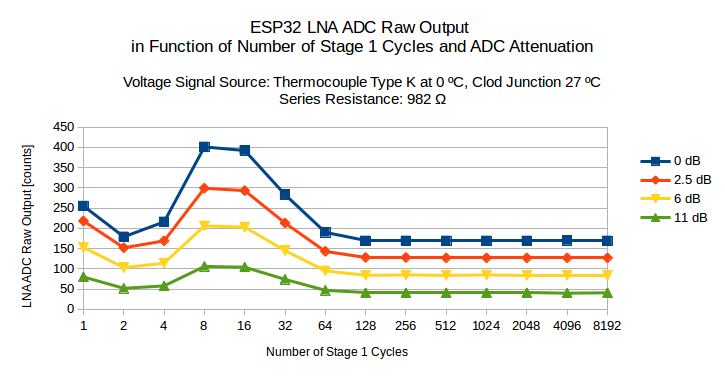

## Characterize LNA

To be able to characterize LNA you need to complete two steps described is Section [Get Started with LNA](../README.md#get-started-with-lna):

* Connect ESP32 board, thermocouple and other components listed in Section [What you Need](what-you-need.md) according to schematic shown in Section [Connect the components](../README.md#connect-the-components).
* Load Arduino or ESP-IDF application code discussed in Section [Load example code and check how LNA works](../README.md#load-example-code-and-check-how-lna-works) onto the ESP32 board.

The code shows repeatedly the following output on terminal. This output is refereed to as a **stage profile**:

```
Ambient temperature: 26 oC, humidity: 44 %
ADC: 9 bit, Attenuation: (0)
   0;    1;    2;    4;    8;   16;   32;   64;  128;  256;  512; 1024; 2048; 4096; 8192; 
   1;  253;  154;  251;  393;  348;  283;  241;  230;  229;  230;  230;  231;  232;  232; 
   2;  255;  157;  244;  393;  349;  283;  241;  230;  230;  229;  230;  229;  231;  233; 
   4;  255;  150;  243;  392;  347;  284;  241;  229;  230;  229;  229;  230;  230;  233; 
   8;  255;  154;  246;  392;  348;  284;  241;  229;  229;  229;  229;  230;  229;  232; 
  16;  255;  162;  242;  393;  348;  284;  240;  231;  229;  228;  230;  229;  231;  233; 
  32;  255;  155;  243;  391;  348;  284;  239;  229;  229;  228;  230;  230;  231;  232; 
  64;  255;  155;  244;  392;  348;  284;  240;  229;  228;  229;  229;  230;  231;  232; 
 128;  255;  154;  243;  392;  347;  283;  240;  229;  228;  227;  229;  229;  229;  232; 
 256;  255;  151;  247;  391;  348;  283;  240;  229;  229;  229;  229;  230;  231;  232; 
 512;  255;  155;  246;  391;  348;  284;  240;  229;  228;  228;  228;  229;  230;  231; 
1024;  255;  155;  243;  390;  348;  284;  240;  229;  229;  229;  229;  229;  231;  233; 
2048;  255;  153;  241;  391;  347;  284;  240;  229;  229;  228;  228;  230;  231;  232; 
4096;  255;  153;  239;  390;  348;  284;  240;  229;  229;  229;  229;  231;  231;  232; 
8192;  255;  143;  238;  389;  349;  285;  242;  230;  231;  230;  230;  232;  232;  233; 
```

By changing of signal on LNA input, adjusting LNA configuration and analyzing the stage profile data, we plan to obtain the following information characterizing of LNA:

* Recommended number Stage 1 and Stage 2 cycles to obtain measurements
* LNA output in function of:

    * input signal voltage
    * input resistance
    * input attenuation

This will effectively provide LNA amplification characteristics in function of the above parameters.

We are planning to vary the following parameters:

1. **Input signal voltage** by changing the temperature of hot junction of the thermocouple within range from 0 ºC to about 90 ºC. For the K type thermocouple with cold junction at 0 ºC this corresponds with voltage from **from 0.00 mV to about 3.68 mV**, see [ITS-90 Reference Table for Type K Thermocouples (PDF)](https://reotemp.com/wp-content/uploads/2015/12/type-k-thermocouple-reference-table.pdf)

2. **Input resistance** by changing **Ri** resistance (see [schematic](../README.md#connect-the-components)) within range from **from 0 Ω to 50 kΩ**. 

3. **Input attenuation** by setting ESP32 ADC1 channel attenuation **to 0 db, 2.5 db, 6 db and 11 db**.

We are planning to wary each parameter one at a time, keep other parameters stable and take the stage profile of the LNA values. The range of **Stage 1 and Stage 3** cycles is **from 1 to 8192**. The Stage 1 cycles are shown in first row and the Stage 3 cycles in first column of the stage profile.

During testing we need to minimize variation of other parameters that may influence the stage profile reading. For instance we need to reduce variation of cold junction temperature (that id tracked as ambient temperature) and noise by keeping all connection short. 


Please refer to sections below for details.


### Recommended number Stage 1 and Stage 3 cycles

[TBA]


### LNA output in function of input signal voltage

[TBA]


### LNA output in function of input resistance

[TBA]


### LNA output in function of input attenuation

[TBA]




[Return to Main Page](../README.md)
