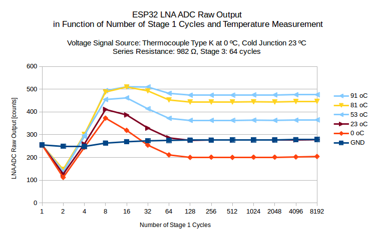
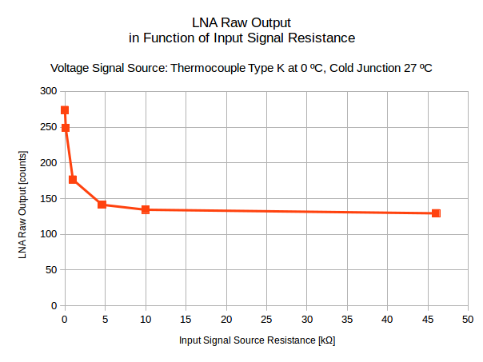

## Characterize LNA

Before checking characteristic of LNA it is recommended to get it work in a simple configuration described in Section [Get Started with LNA](../README.md#get-started-with-lna). 

In this section we are going to demonstrate what parameters are available to configure LNA to operate with a voltage source of specific input resistance and voltage range.

To start with connect ESP32 board, thermocouple and other components listed in Section [What you Need](what-you-need.md) according to schematic below:


Depending on IDE you use load Arduino or ESP-IDF application code:

* Arduino - [esp32-lna-measure.ino](Arduino/esp32-lna-measure/esp32-lna-measure.ino)
* ESP-IDF - [esp32-lna-measure.c](esp32-lna-measure/main/esp_lna_measure.c)

Both application provide identical functionality. They take LNA measurements and show repeatedly the following output on terminal. This output is refereed to as a **stage profile**:

```
Ambient temperature: 26 oC, humidity: 44 %
ADC: 9 bit, Attenuation: (0)
   0;    1;    2;    4;    8;   16;   32;   64;  128;  256;  512; 1024; 2048; 4096; 8192; 
   1;  253;  154;  251;  393;  348;  283;  241;  230;  229;  230;  230;  231;  232;  232; 
   2;  255;  157;  244;  393;  349;  283;  241;  230;  230;  229;  230;  229;  231;  233; 
   4;  255;  150;  243;  392;  347;  284;  241;  229;  230;  229;  229;  230;  230;  233; 
   8;  255;  154;  246;  392;  348;  284;  241;  229;  229;  229;  229;  230;  229;  232; 
  16;  255;  162;  242;  393;  348;  284;  240;  231;  229;  228;  230;  229;  231;  233; 
  32;  255;  155;  243;  391;  348;  284;  239;  229;  229;  228;  230;  230;  231;  232; 
  64;  255;  155;  244;  392;  348;  284;  240;  229;  228;  229;  229;  230;  231;  232; 
 128;  255;  154;  243;  392;  347;  283;  240;  229;  228;  227;  229;  229;  229;  232; 
 256;  255;  151;  247;  391;  348;  283;  240;  229;  229;  229;  229;  230;  231;  232; 
 512;  255;  155;  246;  391;  348;  284;  240;  229;  228;  228;  228;  229;  230;  231; 
1024;  255;  155;  243;  390;  348;  284;  240;  229;  229;  229;  229;  229;  231;  233; 
2048;  255;  153;  241;  391;  347;  284;  240;  229;  229;  228;  228;  230;  231;  232; 
4096;  255;  153;  239;  390;  348;  284;  240;  229;  229;  229;  229;  231;  231;  232; 
8192;  255;  143;  238;  389;  349;  285;  242;  230;  231;  230;  230;  232;  232;  233; 
```

By changing the signal on LNA input, adjusting LNA configuration and analyzing the stage profile data, we plan to obtain the following information characterizing of LNA:

* Recommended number of Stage 1 and Stage 2 cycles to make measurements
* LNA output in function of:

    * input signal voltage
    * input resistance
    * input attenuation

This will effectively provide LNA amplification characteristics in function of the above parameters.

We are planning to vary the following parameters:

1. **Input signal voltage** by changing the temperature of hot junction of the thermocouple within range from 0 ºC to 90 ºC. For the K type thermocouple with cold junction at 25 ºC this corresponds with voltage from **from -1.000 mV to 2.682 mV**, see [ITS-90 Reference Table for Type K Thermocouples (PDF)](https://reotemp.com/wp-content/uploads/2015/12/type-k-thermocouple-reference-table.pdf).

2. **Input resistance** by changing **Ri** series resistance (see [schematic](../README.md#connect-the-components)) within range from **from 100 Ω to 47 kΩ**. 

3. **Input attenuation** by setting ESP32 ADC1 channel attenuation **to 0 db, 2.5 db, 6 db and 11 db**.

We are planning to wary each parameter one at a time, keep other parameters stable and take the stage profile of the LNA values. The range of **Stage 1 and Stage 3** cycles is **from 1 to 8192**. The Stage 1 cycles are shown in first row and the Stage 3 cycles in first column of the stage profile.

The ADC resolution of all the tests has been fixed at **9 bits**. Each measurement is an average of 256 samples.

During testing we need to minimize variation of other parameters that may influence the stage profile reading. For instance we need to reduce variation of cold junction temperature (ambient temperature) and noise by keeping all connection short. 

Please refer to sections below for details.


### Recommended number of Stage 1 and Stage 3 cycles

Analyzing of several tables containing 15 x 15 matrix of numbers is rather boring exercise. To make make it easier and more effective to find patterns in these data I used conditional formatting function of a spreadsheet. Just copy the stage profile table and paste it into a spreadsheet (tested with MS Excel and LibreOffice Calc). In the table each number is separated with a semicolon, so the spreadsheet can recognize the data a [CSV](https://en.wikipedia.org/wiki/Comma-separated_values) and put each number in a separate cell. After applying "color scale" conditional formatting the stage profile looks as follows:


To move further please check if you read Section [LNA Operation](lna-operation.md) that explains the concept of Stage 1 and Stage 3 cycles.


#### Influence of Stage 3 cycles on LNA readings

After checking couple of tables with stage profiles for different values of LNA input voltage (thermocouple temperature), series resistance or attenuation, I realized that the LNA output values do not seem to depend on the number of Stage 3 cycles. I think we can skip analyzing influence of this parameter on LNA output and focus on Stage 1 cycles. For the purpose of next tests I am going to use measurements taken for Stage 3 cycles fixed at 64. Probably we can assume much lower values to shorten time to take measurements. To decide on that some more testing is required with wider range of parameters that influence measurements.


#### Influence of Stage 1 cycles on LNA readings

To check influence of Stage 1 cycles on LNA output I have compiled a chart for measurements taken for Stage 3 fixed at 64 cycles and different temperatures: 



Analyzing couple charts like that for different ESP32 boards we can see similar pattern of LNA output swinging first down, then up, again down and finally stabilizing. From above chart we see that the LNA output value stabilizes if measurement takes 128 Stage 1 cycles. To be on the safe side I would assume taking reading for 1024 cycles of Stage 1. This period takes longer for higher series resistance, see [LNA output in function of input resistance](#lna-output-in-function-of-input-resistance). More testing is required to verify this assumption, likely for different values of external sampling capacitors (see [LNA Operation](lna-operation.md)).


### LNA output in function of input signal voltage

In previous cheaper we have concluded to take LNA measurement for Stage 1 and Stage 3 fixed at 64 and 1024 cycles. Now we can perform series of measurements for different temperatures, convert the temperatures to voltages (see [ITS-90 Reference Table for Type K Thermocouples (PDF)](https://reotemp.com/wp-content/uploads/2015/12/type-k-thermocouple-reference-table.pdf)), consider cold junction temperature and present LNA output in function of input voltage:


It should be noted that for 0 V at the input (hot and cold junction of the thermocouple at the same temperature) the LNA reading is about 277 counts. You can double check this value by taking readings for GPIO36 and 39 connected together.

Some extra measurements should be taken to cover wider range of LNA input signal to verify this characteristics within the whole range of ADC output from 0 to 512 (we have configured ADC at 9 bit resolution), as well as to check the noise for higher bit resolutions.


### LNA output in function of input resistance

Next important step is verification if LNA readings are affected by a resistance connected in series with the input signal (or in general the internal signal resistance). Tests have been made for resistances from 100 Ω to 47 kΩ, as well as for the thermocouple connected directly to the LNA input (without any series resistor). For the direct connection we can assume [internal resistance of the thermocouple of ~4.5 Ω](https://electronics.stackexchange.com/questions/64718/current-produced-by-thermocouples). Raw results including dependency on Stage 1 cycles are shown below:


It should be noted that time to stabilize measurement is longer for bigger series resistance. The following chart shows readings taken for 1024 cycles of Stage 1. 



Above chart is showing visible influence of the input signal resistance on the LNA readings within the range from Ω to about 5 kΩ. This factor should be taken into account when designing LNA into your product. If the input signal resistance is small, it is better to increase it by adding a series resistor. This should provide bigger amplification of the LNA and smaller dependency of the amplification from the resistance changes. Please note that this chart is provided for negative LNA input voltage at -1.081 mV (hot junction of the thermocouple at 0 ºC and cold junction at 27 ºC), so smaller LNA output means bigger amplification.


### LNA output in function of input attenuation

The following chart show dependency of LNA reading from input signal attenuation. ESP32 provides four fixed attenuation settings at 0 db, 2.5 db, 6 db and 11 db. All previous measurements have been done for 0 db attenuation.


[Return to Main Page](../README.md)
