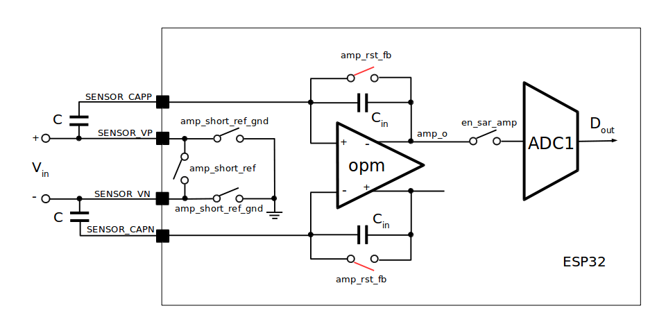
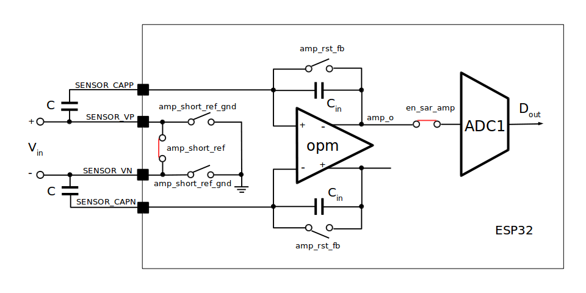

## LNA Operation

The low noise amplifier is controlled by setting specific fields in registers defined in file [soc/sens_reg.h](https://github.com/espressif/esp-idf/blob/v4.0-dev/components/soc/esp32/include/soc/sens_reg.h). 

Basing on [original technical reference manual](https://esp32.com/viewtopic.php?t=6745#p29008), processing of voltage signal on `SENSOR_VP` and `SENSOR_VN` inputs of ESP32, up to providing raw digital value on ADC's output, may be split into four phases:

* Stage 1: charge external sampling capacitors
* Stage 2: intermediate stage, the sampling capacitors are disconnected from both the input and internal capacitors
* Stage 3: charge transfer from external sampling capacitors to the internal capacitors
* Stage 4: ADC conversion

Duration of each phase is configurable.

### Analog Signal Processing

Below is visualization of positions of internal switches responsible for sampling the voltage signal connected to `SENSOR_VP` and `SENSOR_VN` inputs and transferring it inside the LNA and to the ADC. 

#### Stage 1

Internal capacitors `Cin` are bypassed by closing `anp_rst_fb` switches and external capacitors `C` are charged from signal connected to `Vin`.

#### Stage 2

This is intermediate stage when both `anp_rst_fb` switches are opened.

#### Stage 3

The switch `amp_short_ref` is closed to connect external capacitors together and effectively short `Vin` input signal. The charge on external capacitors `C` can now be transferred to internal capacitors `Cin`. 

#### Stage 4

Finally the signal on LNA's output is converted by the ADC and may be read by digital part of ESP32.

### Timing of the Signal Processing

Duration of first three stages described above is configurable by setting `SENS_SAR_AMP_WAITn` fields of `SENS_SAR_MEAS_WAITm_REG` registers. This setting is critical to provide enough time to saturate charge on external and then internal capacitors. Reading the voltage "on the slope" may not provide repeatable readings.

Transferring between stages is controlled by FSM. The stage duration is provided in cycles. The cycle counters are driven by RTC fast clock running at 8 MHz and the single cycle duration is 0.125 ns.

[Return to Main Page](../README.md)
