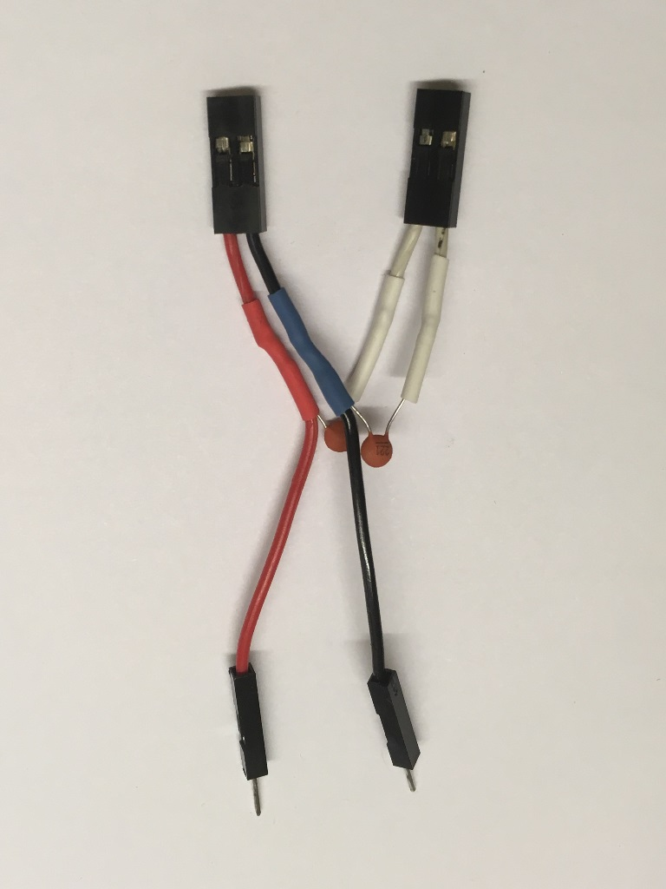
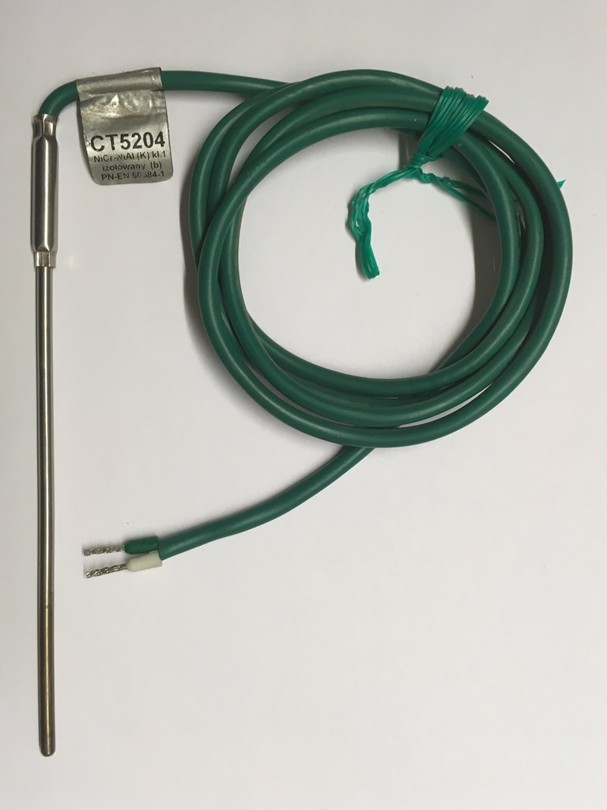
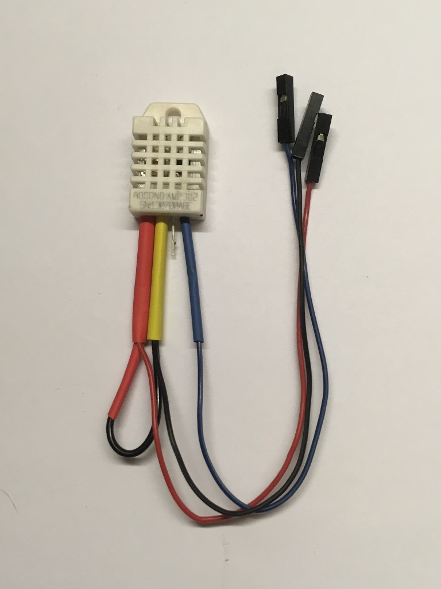
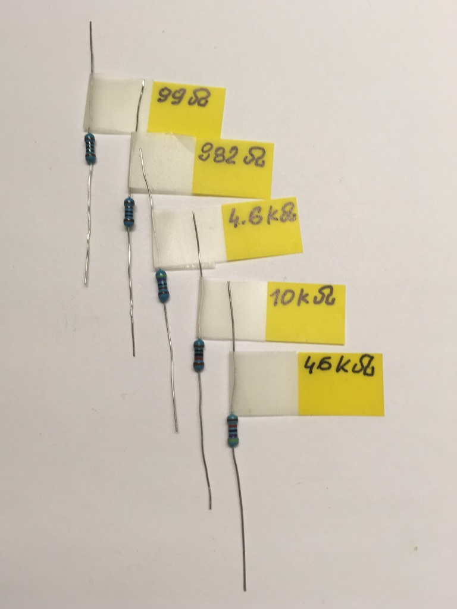
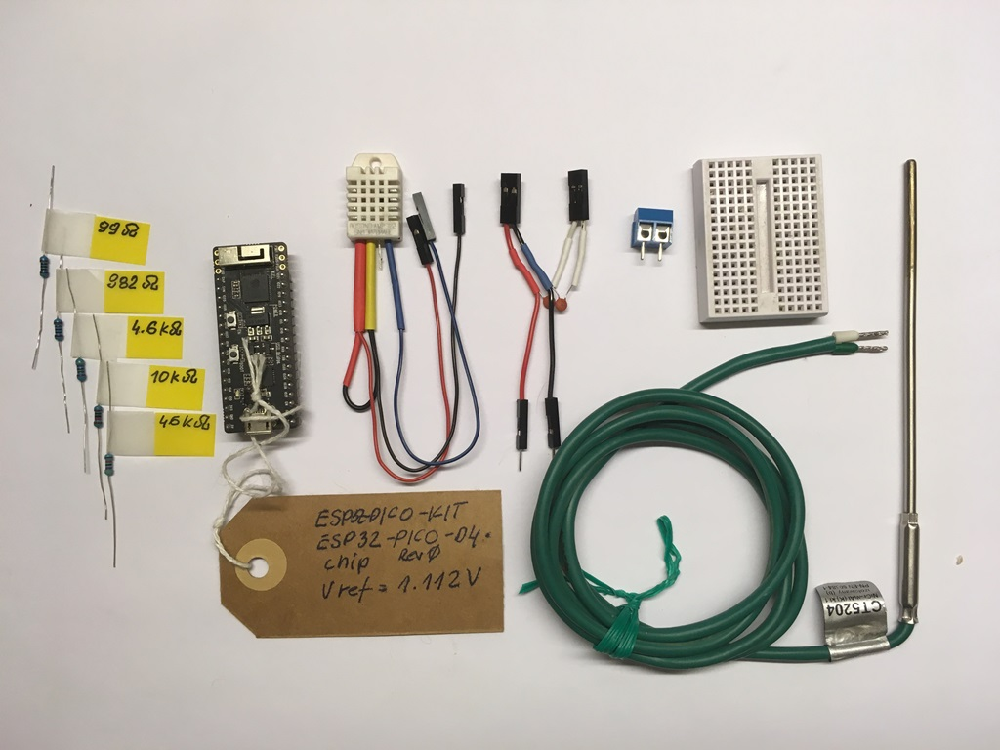
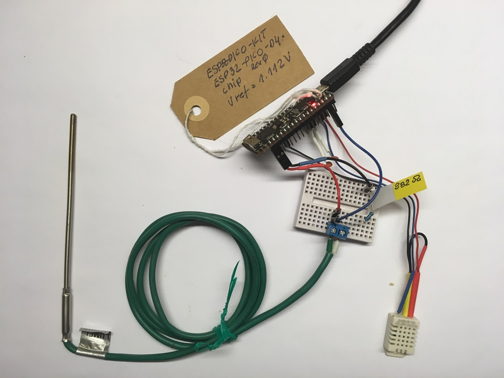
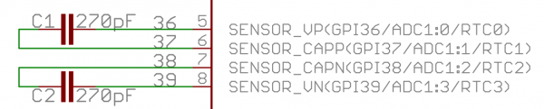
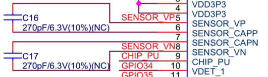
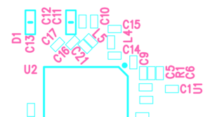

## What you Need

To characterize the LNA I have been using the following components and recommend using the same or similar, so you are able to compare measurements:

* **ESP32-PICO-KIT** development board, see [LNA Enabled Boards](#lna-enabled-boards) for other options.
* **Two 220 pF capacitors**. Original documentation by Espressif provided 270 pF capacitors. I did not have such exact value and used 220 pF instead. 
* **Thermocouple type K** that will act as the source of a small DC signal. My exact model was `CT5204 NiCr-NiAl (K) izolowany (b) PN-EN60584-1` by [LUMEL](https://www.lumel.com.pl). Exact model is not critical, just make sure you have a thermocouple type K from a known vendor.
* **1 kOhm resistor** to connect in series with the thermocouple. I will show later why it is required.
* Optional resistors 100 Ohm, 4.7 kOhm, 10 kOhm and 50 kOhm to verify how input signal resistance affects operation of the LNA.
* AM2302 **temperature sensor** to monitor [cold junction](https://blog.beamex.com/thermocouple-cold-junction-compensation) temperature of the thermocouple. An ESP-IDF component to operate AM2302 [is included in this repository](../components/dht). You may connect any other sensor that works with ESP32, or use an ordinary thermometer instead. 
* A **vacuum cup** with some ice inside to place the thermocouple tip in a stable 0 ºC temperature and have a predictable level of voltage signal on the thermocouple terminals. 
* Couple of **wires** and a breadboard to connect all the elements together. You may need a screw terminal block depending on a type of terminals of your thermocouple.
* A **computer** [configured and tested](https://docs.espressif.com/projects/esp-idf/en/latest/get-started/index.html) to work with [ESP-IDF](https://github.com/espressif/esp-idf).
* A **USB cable** to connect the ESP32 board to the computer.

Here is a gallery of most of elements I have been using:

|   |    |    |    |
|---|---|---|---|
|  Sampling capacitors  |  Thermocouple type-K  |  Temperature sensor  |  Set of test resistors  |

|    |    |
|---|---|
|  All test components  |  Test circuit assembled  |

### LNA Enabled Boards

To be able to use LNA you need an ESP32 board with external sampling capacitors installed or with GPIO pins 36, 37, 38 and 39 exposed, so you can connect capacitors yourself, see [LNA Operation](lna-operation.md) for information why external capacitors are required.

There are three typical options to select from:

* (1) **ESP32 board with exposed GPIO pins 36, 37, 38 and 39 and add sampling capacitors**. Such pins are available on [ESP32-PICO-KIT](https://docs.espressif.com/projects/esp-idf/en/latest/hw-reference/get-started-pico-kit.html). Please note that on most of boards GPIO pins 37 and 38 are typically not accessible. If you find another similar board then double check if it has the sampling capacitors already installed (see below).

* (2) **ESP32 board that has sampling capacitors already installed**. You need to verify this on the module schematic checking for two sampling capacitors, one connected between GPIO pins 36, 37 and another between pins 38, 39.

  

  A board that has the sampling capacitors on schematic is [ESP32 Thing](https://learn.sparkfun.com/tutorials/esp32-thing-hookup-guide?_ga=2.3570232.94544216.1565799556-247462353.1565799556). Please note that this board also has all the GPIO pins 36, 37, 38 and 39 exposed.

* (3) **ESP32 board or module that has space reserved to install the sampling capacitors**. This is assuming that you have the skills and tools to solder / desolder. Suitable modules are e.g. [ESP32-WROOM-32D](https://docs.espressif.com/projects/esp-idf/en/latest/hw-reference/modules-and-boards.html#esp32-wroom-32d-esp32-wroom-32u). Respective schematic looks as below:

  

  Please verify if particular module has the space reserved to install capacitors. A picture above shows that the sampling capacitors C16 and C17 are not connected / not installed (NC). On picture below for the same module, see [ESP32-WROOM-32D-V2.2 & ESP32-WROOM-32U-V2.1 Reference Design r1.0](https://www.espressif.com/sites/default/files/documentation/esp32-wroom-32desp32-wroom-32u_reference_design.zip), C16 and C17 markings are shown on solder mask.

  

  Please note that you will need to remove a metal shielding can from the ESP32-WROOM-32U module before being able to solder the capacitors. 

[Return to Main Page](../README.md)
