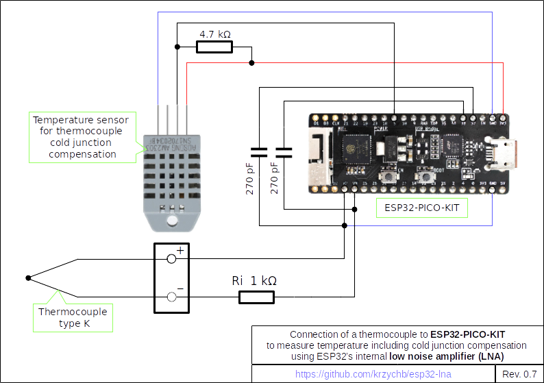

# ESP32 LNA Measure Example

For description of this example please refer to [Check how LNA works](../README.md#check-how-lna-works) and use connection schematic below.

[Return to Main Page](../README.md)
